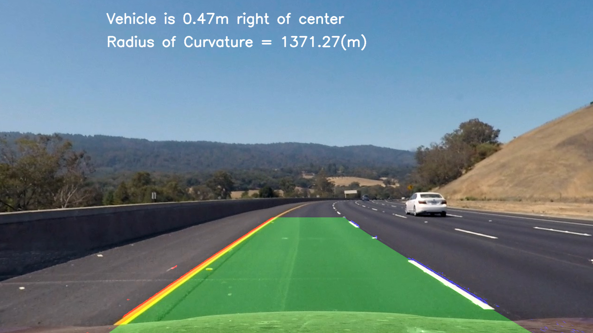

# **Advanced Lane Detection** 

Overview
---

This project represents an advanced lane finding algorithm that utilizes the concepts of camera calibration, distortion removal, gradient thresholding and the utility of multiple color spaces. This project uses Python and OpenCV for the coding.

The project consistes of a few key files/folders which describe the project in detail:
1. A file containing project code ([StartupCode.ipynb](https://github.com/iammsg/Project2/blob/master/StartupCode.ipynb)): This python notebook details the steps undertaken to calibrate the camera, remove distortions, and apply several thresholds to accurately identify lanes on the sample test images
2. A file containing project code ([VideoCode.ipynb](https://github.com/iammsg/Project2/blob/master/VideoCode.ipynb)): This python notebook  is similar to the above `StartupCode.ipynb` except that is specifically to parse the through the project video and draw out the lane detections.
3. A writeup that decribes the solution ([Writeup.md](https://github.com/iammsg/Project2/blob/master/Writeup.md)): This markdown file describes the pipeline in detail, identifies some of the key shortcomings and wraps up with a few possible improvements.
4. The final project video ([Project_Video.mp4](https://github.com/iammsg/Project2/blob/master/Project_Video.mp4)

These were created in accordance to the [project rubric](https://review.udacity.com/#!/rubrics/571/view)